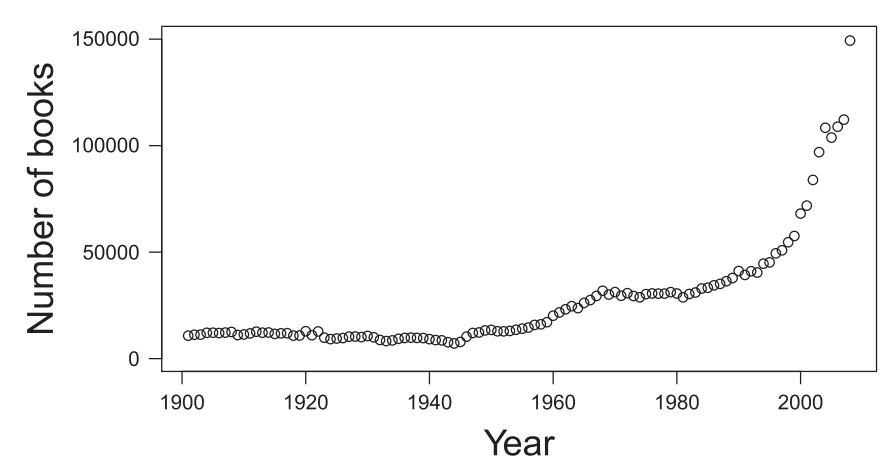
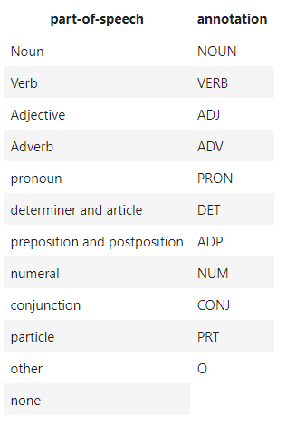
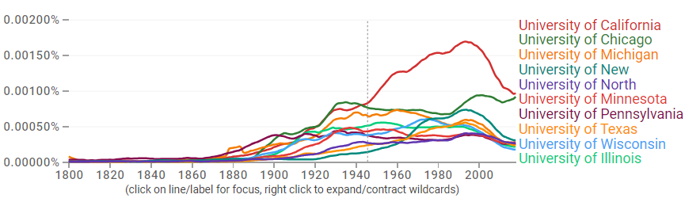
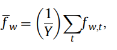
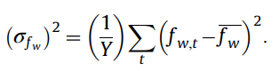
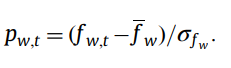

>>>>>  gd2md-html alert:  ERRORs: 0; WARNINGs: 0; ALERTS: 7.

<ul style="color: red; font-weight: bold"><li>See top comment block for details on ERRORs and WARNINGs. <li>In the converted Markdown or HTML, search for inline alerts that start with >>>>>  gd2md-html alert:  for specific instances that need correction.</ul>

Links to alert messages:
<a href="#gdcalert1">alert1</a>
<a href="#gdcalert2">alert2</a>
<a href="#gdcalert3">alert3</a>
<a href="#gdcalert4">alert4</a>
<a href="#gdcalert5">alert5</a>
<a href="#gdcalert6">alert6</a>
<a href="#gdcalert7">alert7</a>

>>>>> PLEASE check and correct alert issues and delete this message and the inline alerts.

Общеизвестно, что язык представляет собой динамическую систему, в которой происходят постоянные изменения. В течение исторических периодов разной продолжительности трансформации подвергаются все уровни: фонетика и письмо, морфология и лексика, синтаксис и семантика. Частота появления некоторых элементов и явлений снижается, причем бывает, что некоторые явления и элементы полностью исчезают, а другие появляются или начинают появляться гораздо чаще, чем раньше. Языковые изменения тесно связаны с другими типами явлений, но прежде всего с психологическими, социальными и культурными. Задача диахронического исследования – выявить, описать и интерпретировать изменения в языке с течением времени.

До недавнего времени такого рода исследования требовали много сил и времени. Сегодня компьютерные технологии и корпусная лингвистика дают вам принципиально новые инструменты. Лингвистические корпуса и менеджеры корпусов позволяют относительно легко получить данные о встречаемости языковых единиц в разные периоды времени. Например, в исследовании Charlesworth и Caliskan (2022), используя векторные эмбеддинги 850 миллиардов слов в англоязычных Google Книгах, авторы проводят обширный анализ исторических изменений и стабильности представлений социальных групп (стереотипов) на протяжении длительного периода времени (с 1800 по 1999 год) для большого количества целевых социальных групп. (Черный, Белый, Азиат, Ирландец, Латиноамериканец, Индеец, Мужчина, Женщина, Старый, Молодой, Толстый, Худой, Богатый, Бедный) и их возникающие восходящие ассоциации с 14 000 слов и подмножеством из 600 черт (рис.1)

Рис.1. Изменение тональности стереотипов о группах людей по годам

Большие данные сегодня широко используются в цифровой культуре как многообещающий метод получения нового понимания из огромных скоплений информации. Возможность собирать огромные объемы данных из текста, изображений и медиа (голос, видео), агрегировать данные и анализировать их с помощью компьютеризированных алгоритмов создает безграничные перспективы во многих областях. Лекарства разрабатываются на основе данных, измеренных и собранных у пациентов прямо во время лечения. Бизнес-аналитика является неотъемлемой частью банков, правительств и рынка в целом. Шмидт и Липсон (2009) объясняют, как они выводят законы Ньютона из системы анализа данных, используя алгоритмы для обнаружения закономерностей маятника. Google может переводить с китайского на английский на основе агрегирования предыдущих переводов в поисках сходства.

Майер-Шенбергер и Кукиер (2013) описывают множество способов использования больших данных для анализа, но также выражают обеспокоенность по поводу их последствий. Они выражают обеспокоенность по поводу замены машинами человеческой деятельности и принятия решений. Есть, например, этические вопросы, касающиеся автомобиля Google с автоматической коробкой передач, которые необходимо решить. Они также поднимают вопросы конфиденциальности при сборе и интерпретации транзакций, голосовых вызовов, изображений и видео, снятых агентами-людьми.

Еще одна проблема, связанная с большими данными, может быть связана с тем, что они в основном используются предприятиями. Как отметил Лейни (2001): «В течение 2003–2004 годов методы решения проблем, связанных с увеличением объема, скорости и разнообразия данных в электронной коммерции, станут более формализованными/разнообразными. Эти методы все чаще включают в себя компромиссы и архитектурные решения, которые влияют на портфели приложений и решения по бизнес-стратегии». Большие данные могут иметь первостепенное значение для организаций, которые могут получить прибыль от их извлечения.

Бойд и Кроуфорд (2012) также поднимают критические вопросы о больших данных: «Помогут ли крупномасштабные поисковые данные нам создать более эффективные инструменты, услуги и общественные блага? Или это приведет к новой волне вторжений в частную жизнь и агрессивного маркетинга? Поможет ли анализ данных нам понять интернет-сообщества и политические движения? Или его будут использовать для отслеживания протестующих и подавления высказываний?» Бойд и Кроуфорд отмечают, что «мы — наши инструменты» и: «Эра больших данных только началась, но уже важно, чтобы мы начали подвергать сомнению предположения, ценности и предвзятости этой новой волны исследований».

Маркетинг больших данных создал образ процесса, который потенциально может заменить традиционные методы анализа, обеспечивая прогнозирование практически всего. Лазер и др. (2014) указывают на проблемы с этой верой в большие данные в своем анализе Google Flu Trends (GFT). Возможности больших данных гораздо более ограничены, чем мы склонны предполагать Лазер и др. Обратите внимание, что «высокомерие больших данных» является одним из факторов, способствующих этому, а вторым фактором является «динамика алгоритмов, изменения, внесенные инженерами для улучшения коммерческих услуг и потребителями при использовании этих услуг». Некоторые изменения в алгоритме поиска Google и поведении пользователей, вероятно, повлияли на отслеживание GFT». Лазер и др. также задают вопрос измерениям: «Действительно ли приборы отражают интересующую теоретическую конструкцию? Является ли измерение стабильным и сопоставимым в разных случаях и во времени? Являются ли ошибки измерений систематическими?»

Цифровые гуманитарные науки предоставляют возможности для научного использования больших данных с использованием компьютеризированных ресурсов текста, изображений, голоса и видео. Область цифровых гуманитарных наук обслуживают такие организации, как Альянс организаций цифровых гуманитарных наук (ADHO) и centerNet, международная сеть, объединяющая около 100 центров цифровых гуманитарных наук в 19 странах, работающих вместе на благо цифровых гуманитарных наук и смежных областей. Во многих университетах созданы факультеты и исследовательские центры цифровых гуманитарных наук, например, в Университетском колледже Лондона и Принстонском университете. Однако цифровые гуманитарные науки все еще находятся в зачаточном состоянии. Как отметил Боргман (2009): «Сообщество цифровых гуманитариев создало несколько прекрасных работ и добилось большого прогресса в технологиях, дизайне и стандартах. Сейчас настал момент консолидировать эти знания и сформулировать требования и цели сообщества».

Идея количественной оценки гуманитарных наук имеет исторические корни. Латур (2010) описал идеи Габриэля Тарда: «Когда Тард утверждал, что однажды статистику будет так же легко читать, как газеты, он не мог предвидеть, что сами газеты будут настолько преобразованы в результате цифровизации, что сольются в новую область визуализации данных. Это явный пример того, как ученый-социолог на столетие опередил свое время, поскольку он предвидел качество связи и прослеживаемости, необходимое для хорошей статистики, которое было совершенно недоступно в 1900 году». Латур считает, что большие данные могут устранить разрыв между микро- и макросом в социологии, а также необъяснимые отношения между макросоциальными явлениями и людьми, принимающими участие в этих явлениях. Латур (2010) описал это видение: «Дело в том, что целое утратило свой привилегированный статус: мы можем создавать из одних и тех же точек данных столько агрегатов, сколько считаем нужным, возвращаясь в любой момент обратно к отдельным компонентам». Это именно то движение, которое предвосхищала социальная теория Тарда, хотя у него не было другого инструмента для объяснения своего видения, кроме его прозы».

Маррес (2012) исследует влияние цифровых технологий на социальные исследования и призывает к «перераспределению исследований», концепции, которая «подчеркивает, что научные исследования, как правило, включают вклад широкого круга участников: исследователей, субъектов исследования, спонсоров, поставщики исследовательских материалов, строители инфраструктуры, заинтересованные любители и так далее». Маррес исследует перераспределение методов эмпирическим путем, изучая онлайн-платформы социальных исследований. Одной из платформ является инструмент онлайн-текстового анализа под названием Co-Word Machine, который основан на анализе ко-слов. Маррес упоминает, что ко-слова начали появляться в 1980-х годах, но «в 1980-х годах аналитики ко-словов были разочарованы в этом проекте ограничениями баз данных». 

«Перераспределение технологий», развитие массивных наборов данных и баз данных теперь позволяют лучше анализировать ко-слова. Примером может служить Google Ngram Viewer, инструмент, используемый в дальнейшем в этом исследовании. Другой пример, сочетающий онлайн-текстовый анализ и социальные исследования, описан Мэдсеном (2015). Мэдсен специализируется на цифровой социальной аналитике и описывает проект по разработке «кризисного монитора». Монитор предупреждает о продовольственном кризисе в Индонезии на основе анализа твитов, используя облака тегов для отображения слов, отражающих кризисные ситуации, связанные с продуктами питания. Программный алгоритм предназначен для идентификации выражений в твитах и их классификации по кластерам. Этот проект показывает не только потенциал динамического анализа текста в социальных целях, но и проводит грань между возможностями человека и машины. Результаты визуализируются, но люди оценивают результаты, чтобы выявить кризис.

Одним из текстовых инструментов цифровых гуманитарных наук является Google Ngrams. Этот инструмент был создан на основе сервиса Google Книги, крупнейшей оцифрованной коллекции книг в мире. Google Книги были запущены в 2002 году, вдохновленные расцветом проектов оцифровки в различных библиотеках и учреждениях мира. По данным Википедии, по состоянию на октябрь 2015 года количество отсканированных названий книг составило более 24 миллионов. 

Ключевая идея создателей сервиса состоит в следующем: данные о том, как в течение времени меняется частотность определенных слов и словосочетаний, дают нам новые знания о социально-культурных трендах, общественных изменениях и процессах, открывает возможности сравнить и измерить социальные концепты [1]. Эту идею создатели реализуют, во-первых, собрав огромный объем текстов разного времени и на разных языках, а во-вторых, разработав инструмент для поиска и анализа частотности слов в этих текстах, упорядоченных по году публикации, — Google Ngram Viewer.

Google Ngram Viewer — это онлайн-просмотрщик, изначально основанный на Google Книгах. Он основан на базе данных, первоначально собранной из книг, опубликованных между 1500 и 2000 годами. База данных Google Ngram поддерживает последовательности нграмм от одного до пяти элементов. В датасете хранятся не тексты и даже не отдельные предложения, а лишь последовательности слов длиной от 1 до 5. Такие последовательности называются n-граммы. Элементами могут быть фонемы, слоги, буквы или слова. Например, «Антарктида» — это униграмм, «Советский союз» — биграмм, «Китайская Народная Республика» — триграмм, а устойчивое словосочетание «The United States of America» — пентаграмм, сочетание из пяти слов подряд. Каждая книга была разбита на отдельные слова и словосочетания от 1 слова до 5 слов подряд, и для каждого такого слова или словосочетания было подсчитано количество употреблений: сколько раз это слово или словосочетание встретилось в тексте книги. Каждая книга имеет свой год выпуска. Таким образом, после обработки отдельной книги мы имеем список слов и словосочетаний, употребленных определенное количество раз в год, соответствующий году публикации книги. Далее эти данные обобщаются: для каждого года мы получаем список слов и словосочетаний с суммированной частотностью по всем книгам, изданным в этот год. В датасет попадают n-граммы, которые встретились во всем корпусе текстов не менее 40 раз. Формат представления книг с помощью частотностей nграммов за каждый год позволяет выложить датасет в открытый доступ и дать возможность любому желающему использовать эти данные для собственных исследований.

Для того чтобы частотность слов в разные года можно было сравнивать между собой, используют механизм нормализации. Сравниваю\тся не абсолютные значения частотностей, а относительные, скорректированные в зависимости от объема корпуса: частотность n-грамма делится на общее количество таких же n-граммов в подкорпусе за этот год. Для того чтобы сравнивать частотность этого слова, мы должны учитывать не только то, сколько раз мы его встретили в определенный год, но и как много вообще слов входит в датасет за этот год. Относительные частоты можно сравнивать и отображать в виде единого графика. Без нормализации было бы невозможно сравнить частоту определенного Ngram с течением времени, поскольку количество книг, опубликованных в 1500 году, не равно количеству книг, опубликованных в 2000 году (рис.2). Таким образом, средство просмотра отображает процент от количества появлений, где процент рассчитывается от общего количества книг, изданных в данном году. 

>>>>>  gd2md-html alert: inline image link here (to images/image2.png). Store image on your image server and adjust path/filename/extension if necessary.  (<a href="#">Back to top</a>)(<a href="#gdcalert3">Next alert</a>) >>>>> 

Рис. 2 \
Количество книг в датасете Google Books в распределении по годам издания

Нажатие на точку на графике показывает процент случаев за этот год. Несмотря на это, в самом датасете Google Ngram, лежащем в основе Ngram Viewer, нормализации нет.

Этот датасет появился в результате усилий Google по оцифровке книг. Большинство книг было взято из более чем 40 университетских библиотек по всему миру. Каждая страница сканировалась с помощью специального оборудования, а текст оцифровывался с помощью оптического распознавания символов (OCR). Дополнительные тома – как физические, так и цифровые – были предоставлены издателями. Метаданные с указанием даты и места публикации были предоставлены библиотеками и издательствами и дополнены библиографическими базами данных. Оцифровано более 15 миллионов книг (12% всех когда-либо опубликованных книг).

Полученный корпус в своей первой редакции содержал более 500 миллиардов слов - на английском (361 миллиард), французском (45B), испанском (45B), немецком (37B), китайском (13B), русском (35B) и иврите (2B). Этот корпус не может быть прочитан человеком. Если бы вы попытались читать только записи только за 2000 год, с разумной скоростью 200 слов в минуту, не прерываясь на еду и сон, это заняло бы восемьдесят лет. Последовательность букв в тысячу раз длиннее генома человека: если ее записать по прямой, она дотянется до Луны и обратно 10 раз.

Впоследствии корпус нграмм пополнялся новыми изданиями, расширялся и дорабатывался: исправлялись проблемы с автоматическим распознаванием символов, дополнялись правила токенизации и увеличивался общий размер. На данный момент корпус нграмм имеет три версии - 2009 (первая), 2012 и 2019 года. 

По сравнению с версиями 2009 года, версии 2012 и 2019 годов содержат больше книг, улучшенное распознавание текста, улучшенные метаданные библиотеки и издателя. Версии 2012 и 2019 года также не формируют нграммы, выходящие за границы предложений, и формируют нграммы через границы страниц, в отличие от версии 2009 года.

В корпусах 2012 и 2019 годов токенизация также улучшилась с использованием набора правил, разработанных вручную (за исключением китайского языка, где для сегментации используется статистическая система). В корпусе 2009 года токенизация основывалась просто на пробелах: «слово» в датасете Google n-грамм отличается от привычного лингвистического понимания и трактуется ближе к компьютерному термину «токен», и в простой токенизации по пробелам словами являются также сочетания букв и цифр, например «1-й», или просто цифры, например число π — «3.14159». Словами же будут признаваться и неправильно распознанные слова, слова, написанные с опечаткой, а также слова из другого языка. 

Наконец, версия 2012 года содержит для русского языка 591 310 книг (текстов) или 67 137 666 353 словоупотреблений, с учетом формата которых были написаны несколько библиотек на разных языках программирования; в связи с относительной новизной версии 2019 года и отсутствием прилагающихся к ней описаний произведенных изменений формата, затрудняющим распаковывание файлов, нами принято решение работать со второй версией датасета, датируемой 2012 годом.

Чтобы сгенерировать машиночитаемые имена файлов, были транслитерировали нграммы для языков, в которых используются нелатинские алфавиты (китайский, иврит, русский), и использована начальная буква транслитерированной нграммы для определения имени файла. Тот же подход был использован для таких символов, как ä в немецком языке. Следует обратить внимание, что транслитерация использовалась только для определения имени файла; фактические нграммы кодируются в UTF-8 с использованием алфавита, специфичного для языка.

В версии 2 (от 2012 года)  нграммы были сгруппированы по алфавиту (языки с нелатинской графикой транслитерировались); в версии 1 (2009 года) нграммы разделены на файлы одинакового размера. Кроме того, для каждого корпуса предоставлен файл с именем total_counts, в котором записано общее количество 1-грамм, содержащихся в книгах, составляющих корпус. Этот файл полезен для вычисления относительных частот нграмм; в него включаются только те нграммы, которые встречаются в корпусе более 40 раз. Вот почему сумма вхождений 1-граммы в любом данном корпусе меньше числа, указанного в файле total_counts.

Каждый из файлов представляет собой сжатые данные, разделенные табуляцией. В версии 2, которой мы будем пользоваться в дальнейшем, каждая строка имеет следующий формат:

ngram TAB year TAB match_count TAB Volume_count NEWLINE

В качестве примера приведем 3 000 000-ю и 3 000 001-ю строки из файла английских 1-грамм (googlebooks-eng-all-1gram-20120701-a.gz):

circumvallate   1978   335    91

circumvallate   1979   261    91

Первая строка сообщает нам, что в 1978 году слово «circumvallate» (что означает «окружить валом или другим укреплением») встречалось в общей сложности 335 раз в 91 отдельной книге.

Файлы сильно различаются по размеру, поскольку некоторые буквы встречаются чаще, чем другие: файл «на» будет больше, чем файл «нг», поскольку гораздо больше слов начинаются с «на», чем с «нг». Файлы, за которыми следует буква, за которой следует подчеркивание (например, s_), содержат нграммы, начинающиеся с первой буквы, но имеющие необычный второй символ.

Теги части речи и отношения зависимости определяются автоматически. Оценить точность этих прогнозов сложно, но для современного английского языка авторы предполагают, что точность тегов частей речи составляет около 95 %, а точность отношений зависимости — около 85 %. В старом английском тексте и на других языках точность ниже, но, вероятно, превышает 90 % для тегов части речи и выше 75 % для зависимостей. Это предполагает значительное количество ошибок, которые следует учитывать при составлении выводов. Список тегов, действительных в корпусе, можно увидеть на рис.3.

Теги части речи создаются на основе небольшого обучающего набора (всего миллион слов для английского языка). Иногда это приводит к недооценке необычных словоупотреблений.

>>>>>  gd2md-html alert: inline image link here (to images/image3.png). Store image on your image server and adjust path/filename/extension if necessary.  (<a href="#">Back to top</a>)(<a href="#gdcalert4">Next alert</a>) >>>>> 

Рис.3  \
Список действительных частей речи для корпуса Googlе Ngrams

Принципиально новое направление, для которого может быть использован датасет, — это измерение значимости изменений в частотности слов, отвечающих смене культурных трендов, отражающих влияние исторических событий и даже воздействие политических режимов. Датасет Google nграммов дает возможность посчитать и сравнить самые абстрактные и, казалось бы, совершенно неквантифицируемые понятия, такие как «известность» или «коллективная память». В качестве примеров использования творческого поиска для выявления трендов можно отметить график частоты упоминаний университетов по годам (рис.4)

>>>>>  gd2md-html alert: inline image link here (to images/image4.png). Store image on your image server and adjust path/filename/extension if necessary.  (<a href="#">Back to top</a>)(<a href="#gdcalert5">Next alert</a>) >>>>> 

Рис.4 \
График упоминания университетов по годам показывает тренды в популярности образовательных учреждений.

Для выгрузки и предварительной обработки данных были использованы скрипты Python, предоставляющие простой способ итеративной загрузки, фильтрации и нормализации этих больших наборов данных. Хотя этот набор данных впечатляет, он не застрахован от систематической ошибки выборки. Исследователи показали, что частоты словесных трендов, взятые из корпуса книг Google, преобладают в научной литературе, как показало исследование Pechenick 2015. Для того, чтобы компенсировать внутренние проблемы датасета (обратитесь к Zhang, S. 2015 для более подробного обзора), мы прибегнем к дополнительной нормализации, разработанной в Sindi и Dale (2016): для сравнения данных Google Ngram мы нормализуем эмпирические частоты слов. Сначала мы преобразуем все частоты слов к нормализованным пропорциям для каждого года с 1900 по 2000 год. Затем мы конвертируем частоту каждого слова в его z-показатель. То есть, если f w;t — частота слова w в момент времени t, а Y — количество лет, мы определяем среднее значение и дисперсию эмпирических распределений следующим образом:

>>>>>  gd2md-html alert: inline image link here (to images/image5.png). Store image on your image server and adjust path/filename/extension if necessary.  (<a href="#">Back to top</a>)(<a href="#gdcalert6">Next alert</a>) >>>>> 

>>>>>  gd2md-html alert: inline image link here (to images/image6.png). Store image on your image server and adjust path/filename/extension if necessary.  (<a href="#">Back to top</a>)(<a href="#gdcalert7">Next alert</a>) >>>>> 

Затем мы преобразуем эмпирические распределения в их нормированные частоты (z-показатели):

>>>>>  gd2md-html alert: inline image link here (to images/image7.png). Store image on your image server and adjust path/filename/extension if necessary.  (<a href="#">Back to top</a>)(<a href="#gdcalert8">Next alert</a>) >>>>> 

Таким образом, в датасете, подготовленном для дальнейшей исследовательской работы, остаются годы, н-граммы, их p- и z-показатели.

Источники:

1. Б-о
2. Sindi, Suzanne S., and Rick Dale. "Culturomics as a data playground for tests of selection: Mathematical approaches to detecting selection in word use." Journal of theoretical biology 405 (2016): 140-149.
3. Pechenick, Eitan Adam, Christopher M. Danforth, and Peter Sheridan Dodds. "Characterizing the Google Books corpus: Strong limits to inferences of socio-cultural and linguistic evolution." PloS one 10.10 (2015): e0137041.
4. Michel, Jean-Baptiste, et al. "Quantitative analysis of culture using millions of digitized books." science (2010): 1199644.
5. Диахронические исследования на основе корпуса русских текстов Google Books Ngram Viewer
6. Charlesworth T. E. S., Caliskan A., Banaji M. R. (2022). Historical representations of social groups across 200 years of word embeddings from Google Books // Proceedings of the National Academy of Sciences of the United States of America. T. 119. № 28.
7. Ophir, S. (2016). Big data for the humanities using Google Ngrams: Discovering hidden patterns of conceptual trends. First Monday. https://doi. org/10.5210/fm.v21i7.5567
8. d. boyd and K. Crawford, 2012. “Critical questions for big data: Provocations for a cultural, technological, and scholarly phenomenon,” Information, Communication & Society, volume 15, number 5, pp. 662–679.doi: http://dx.doi.org/10.1080/1369118X.2012.678878, accessed 24 June 2016.
9. B. Latour, 2010. “Tarde’s idea of quantification,” In: M. Candea (editor). _The social after Gabriel Tarde: Debates and assessments_. London: Routledge, pp. 147–164.
10. D. Lazer, R. Kennedy, G. King and A. Vespignani, 2014. “The parable of Google Flu: Traps in big data analysis,” _Science_, volume 343, number 6176 (14 March), pp. 1,203–1,205. doi:[http://dx.doi.org/10.1126/science.1248506](http://dx.doi.org/10.1126/science.1248506), accessed 24 June 2016.
11. M. Schmidt and H Lipson, 2009. “Distilling free-form natural laws from experimental data,” _Science_, volume 324, number 5923 (3 April), pp. 81–85.doi: [http://dx.doi.org/10.1126/science.1165893](http://dx.doi.org/10.1126/science.1165893), accessed 24 June 2016.
12. Mayer-Schönberger and K. Cukier, 2013. _Big data: A revolution that will transform how we live, think and work_. London: John Murray.
13. N. Marres, 2012. “The redistribution of methods: On intervention in digital social research, broadly conceived,” Sociological Review, volume 60, supplement S1, pp. 139–165. doi: http://dx.doi.org/10.1111/j.1467-954X.2012.02121.x, accessed 24 June 2016.
